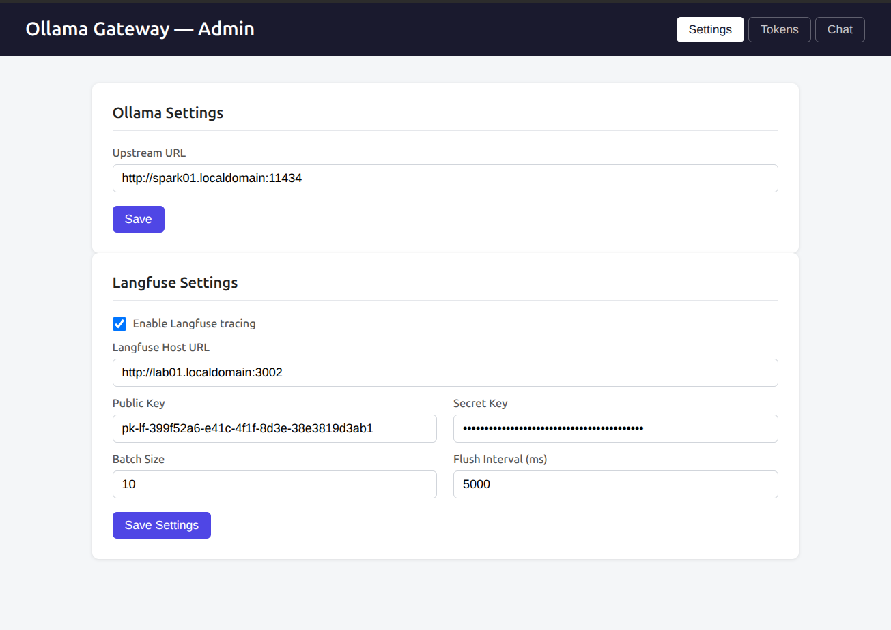
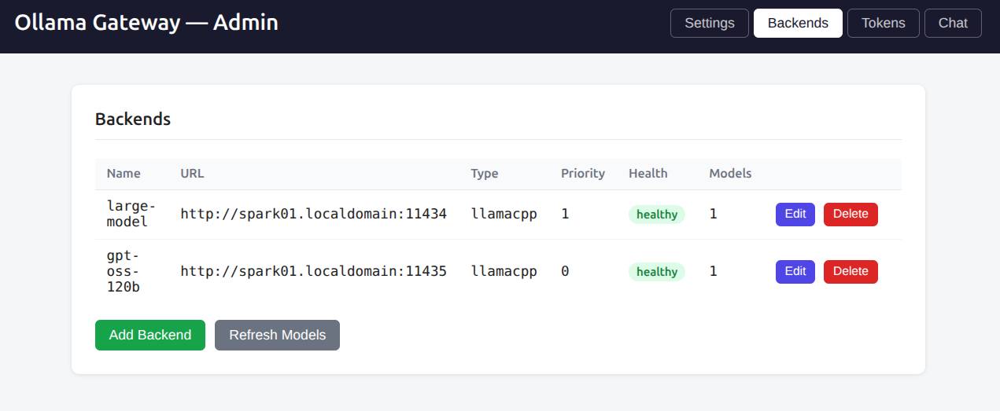
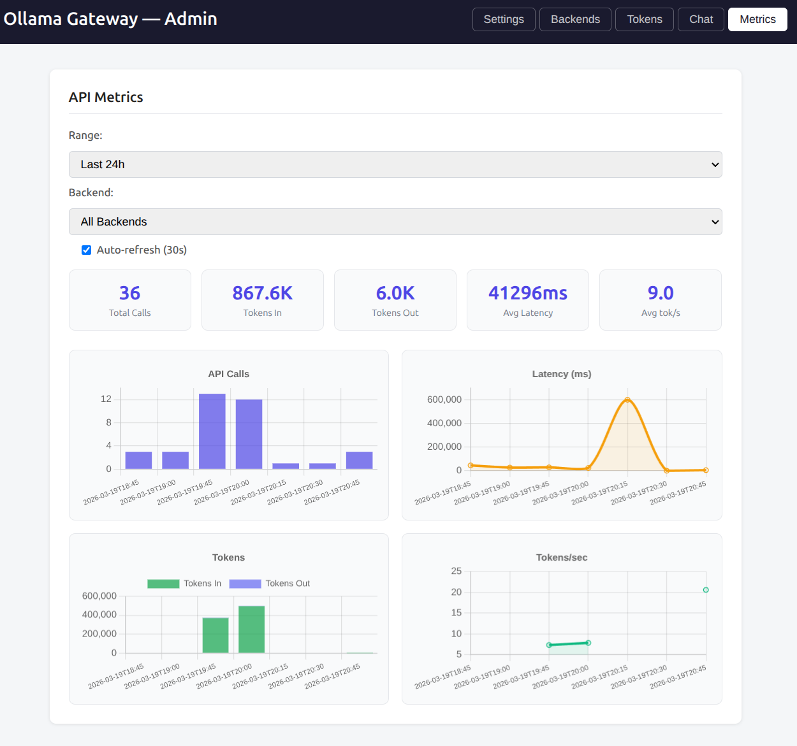

# Ollama Gateway

<p align="center">
  
</p>

An authenticated reverse proxy for [Ollama](https://ollama.com) and [llama.cpp](https://github.com/ggerganov/llama.cpp) with [Langfuse](https://langfuse.com) tracing and a web-based admin UI.

Ollama Gateway now also supports model aggregation so that you can use it to make multiple llama.cpp, vllm, or sglang instances appear as if they were one endpoint (see image below).

<p align="center">
  
</p>

The admin UI includes a Metrics page that provides real-time visibility into API usage, including call counts, token throughput, latency, and per-backend breakdowns. Use it to monitor gateway health and identify performance bottlenecks at a glance.

<p align="center">
  
</p>


## Features

- Bearer-token authentication for all upstream endpoints
- Langfuse tracing for `/api/chat`, `/api/generate`, `/api/embed`, `/api/embeddings`, `/v1/chat/completions`, `/v1/completions`, `/v1/embeddings`
- Supports both **Ollama** (native API) and **llama.cpp** (OpenAI-compatible API) backends
- Runtime management via web admin UI (backend type, tokens, Langfuse settings)
- Configuration persisted to TOML on every admin change

## Quick Start

```bash
cp config.example.toml config.toml
# Edit config.toml as needed

cargo run -- --config config.toml
```

Navigate to `http://localhost:8081/` — the admin UI is open by default. Set a password for it from the **Settings** tab whenever you're ready to restrict access.

## Configuration

See [`config.example.toml`](config.example.toml) for all options.

```toml
[ollama]
upstream_url = "http://localhost:11434"
# backend_type = "ollama"   # or "llamacpp" — defaults to "ollama"

[langfuse]
enabled = false
host    = "https://cloud.langfuse.com"
public_key = ""
secret_key = ""

[[tokens]]
token    = "sk-myapp-abc123"
app_name = "my-app"

[server]
listen_addr = "0.0.0.0"
listen_port = 8080
```

## Environment Variables

| Variable         | Default | Description                                                                 |
|------------------|---------|-----------------------------------------------------------------------------|
| `PROXY_PORT`     | `8080`  | Port the Ollama proxy listens on. Overrides `server.listen_port` in config. |
| `ADMIN_PORT`     | `8081`  | Port the admin UI listens on. Overrides `server.admin_port` in config.      |
| `RUST_LOG`       | `info`  | Log level filter. Use `debug` for request/Langfuse flush details.           |

The admin UI password is no longer set via an environment variable — it's managed from the admin UI's Settings tab and stored (as an Argon2id hash) in `config.toml`. Leaving it unset means the admin UI requires no login.

## Docker

```bash
docker run -d \
  -p 8080:8080 \
  -p 8081:8081 \
  -e PROXY_PORT=8080 \
  -e ADMIN_PORT=8081 \
  -v /path/to/config.toml:/etc/ollama_gateway/config.toml \
  avirtuos/ollama_gateway:latest
```

Set an admin password from the Settings tab after first start — see [Admin UI](#admin-ui) below.

## Portainer Stack

Paste the following into **Portainer → Stacks → Add stack → Web editor**. Set the environment variables in Portainer's "Environment variables" panel below the editor.

```yaml
version: "3.8"

services:
  ollama_gateway:
    image: avirtuos/ollama_gateway:latest
    restart: unless-stopped
    ports:
      - "${PROXY_PORT:-8080}:8080"
      - "${ADMIN_PORT:-8081}:8081"
    environment:
      - PROXY_PORT=${PROXY_PORT:-8080}
      - ADMIN_PORT=${ADMIN_PORT:-8081}
      - RUST_LOG=${RUST_LOG:-info}
    volumes:
      - ollama_gateway_config:/etc/ollama_gateway

volumes:
  ollama_gateway_config:
```

**Stack environment variables** (set these in Portainer's "Environment variables" panel below the editor):

| Variable         | Example          | Description                                     |
|------------------|------------------|-------------------------------------------------|
| `PROXY_PORT`     | `8080`           | Host port for the Ollama proxy                  |
| `ADMIN_PORT`     | `8081`           | Host port for the admin UI                      |
| `RUST_LOG`       | `info`           | Log verbosity (`error`, `warn`, `info`, `debug`) |

> **Note:** On first start the gateway will create a default `config.toml` inside the volume. Configure Langfuse and tokens via the admin UI at `http://<host>:${ADMIN_PORT}/` — all changes are persisted back to the volume automatically.

## Admin UI

Browse to `http://<host>:${ADMIN_PORT}/`. By default the admin UI requires no login; from the **Settings** tab, check "Require a password to access this admin UI" and set one to restrict access. Once a password is set, visiting the UI shows a login screen — sessions are tracked with a cookie, so you won't be prompted again on refresh, and only clear on logout or gateway restart.

From the UI you can:
- Set the upstream URL and **backend type** (Ollama or llama.cpp)
- Enable/disable Langfuse and update all Langfuse settings
- Add or remove Bearer tokens at runtime
- Set or remove the admin UI password
- Chat directly with the upstream model to verify connectivity

All changes are persisted immediately to the TOML config file.

### Backend Types

| Backend | `backend_type` | Model list endpoint | Chat endpoint |
|---------|---------------|---------------------|---------------|
| Ollama  | `ollama`      | `GET /api/tags`     | `POST /api/chat` (NDJSON streaming) |
| llama.cpp | `llamacpp`  | `GET /v1/models`    | `POST /v1/chat/completions` (SSE streaming) |

Clients connecting to the proxy port can use either API style regardless of backend type — the transparent proxy forwards requests as-is. The backend type setting only affects the **admin UI** (model listing and the built-in chat).

## CI/CD — GitHub Secrets Required

The GitHub Actions workflow (`.github/workflows/docker.yml`) publishes the image to Docker Hub on every merge to `main`. Configure these secrets in your repository settings (**Settings → Secrets and variables → Actions**):

| Secret               | Description                                                      |
|----------------------|------------------------------------------------------------------|
| `DOCKERHUB_USERNAME` | Docker Hub username (e.g. `avirtuos`)                           |
| `DOCKERHUB_TOKEN`    | Docker Hub access token — generate at hub.docker.com → Account Settings → Security |

The workflow produces two tags on each push:
- `avirtuos/ollama_gateway:latest`
- `avirtuos/ollama_gateway:<git-sha>`
